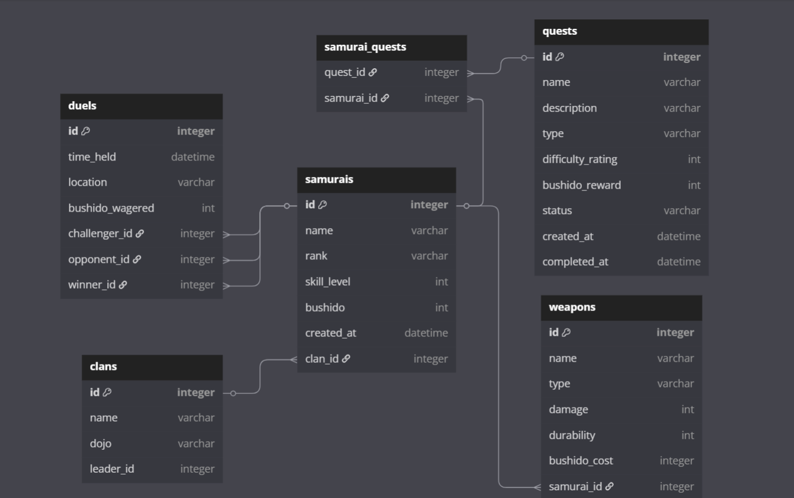

# Samurai Champloo

## 📝 Table of Contents

- [About](#about)
- [Getting Started](#getting_started)
- [Deployment](#deployment)
- [Usage](#usage)
- [Built Using](#built_using)
- [TODO](../TODO.md)
- [Contributing](../CONTRIBUTING.md)
- [Authors](#authors)
- [Acknowledgments](#acknowledgement)

Welcome to Samurai CLI, a samurai-themed command-line application built in Python using SQLAlchemy. This immersive project lets users simulate a feudal world where legendary samurais join clans, embark on quests, wield powerful weapons, and engage in epic duels to earn bushido (honour).

## 🌸 Features

- Manage **Samurais** with skills, ranks, bushido points, and clan affiliations.
- Wield, buy, and sell various **Weapons** with different damage and durability.
- Accept **Quests** of varying difficulty, type, and rewards.
- Track quest **status** per samurai.
- Form and manage powerful **Clans** with dojo names and leaders.
- Challenge others to **Duels**, with winners determined by skill and gear.
- Explore hand-crafted **Locations** and interact with a rich set of names and lore.

## 🗃️ Schema Overview



[Link to the Database Schema](https://dbdiagram.io/d/Samurai-champloo-68346bb86980ade2eb6d6344)

Tables
- `samurais`: Samurai warriors with skill levels, ranks, and bushido points

- `clans`: Groupings of samurais with dojo locations and clan leaders

- `weapons`: Arms owned by samurais

- `quests`: Missions offering bushido rewards

- `duels`: One-on-one battles between samurais

- `samurai_quest`: Many-to-many relation table between samurais and quests

## Installation Guide

1. Clone this repository to your local machine and navigate to the project directory.
```
git clone https://github.com/Ian-wafula1/samurai-champloo/
cd samurai-champloo
```
2. Create a virtual environment and activate it:
```
pipenv install && pipenv shell
```
3. Navigate into the lib folder and run the following commands to initialize the database.
```
cd lib
alembic upgrade head
./app.py seed-database
```

4. Run the following command to view the help menu.
```
./app.py --help
```

### Getting Started

Run the following command to open the help menu
```
./app.py --help
```
The following commands are available:

  - `./app.py samurais`: Open the samurais menu

    1. View samurai rankings
    2. Create new samurai
    3. Update existing samurai
    4. Delete samurai
    5. Perform actions on specific samurai
        - View details
        - Start duel
        - View owned weapons
        - Buy Weapon
        - Sell Weapon
        - Join clan
        - Leave current clan
        - Repair weapon
        - Participate in quest
        - Complete quest
        - View duel history


  - `./app.py clans`: Open the clans menu

     1. View clan rankings
     2. Create new clan
     3. Update existing clan
     4. Delete clan
     5. View clan details


  - `./app.py weapons`: Open the weapons menu

      1. View all weapons
      2. View weapons available for purchase
      3. Add weapon
      4. Update existing weapon
      5. Delete weapon
      6. View weapon details


  - `./app.py quests`: Open the quests menu

      1. View all quests
      2. Create new quest
      3. Update existing quest
      4. Delete quest
      5. View details of specific quest
      6. View participating samurais of specific quest


  - `./app.py seed-database`: Create seed data for the database (This resets all data in the database)

  - `./app.py clear-database`: Clear the database


## ⛏️ Built Using <a name = "built_using"></a>

- Alembic - Database Migrations
- SQLAlchemy - Object-Relational Mapping
- Typer - Command-Line Interface

## ✍️ Authors <a name = "authors"></a>

- [@Ian-wafula1](https://github.com/Ian-wafula1) - Idea & Initial work

## 🎉 Acknowledgements <a name = "acknowledgement"></a>

- Shinichirō Watanabe - For creating the show `Samurai Champloo`
- My Classmate - For convincing me to be creative with my project 
